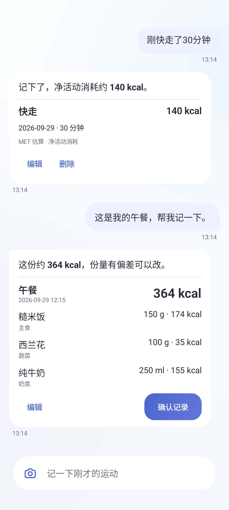
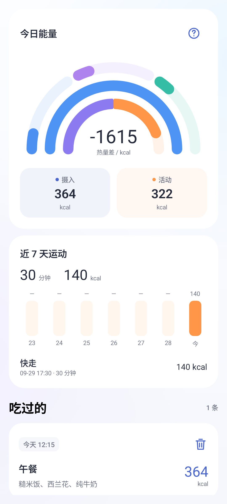
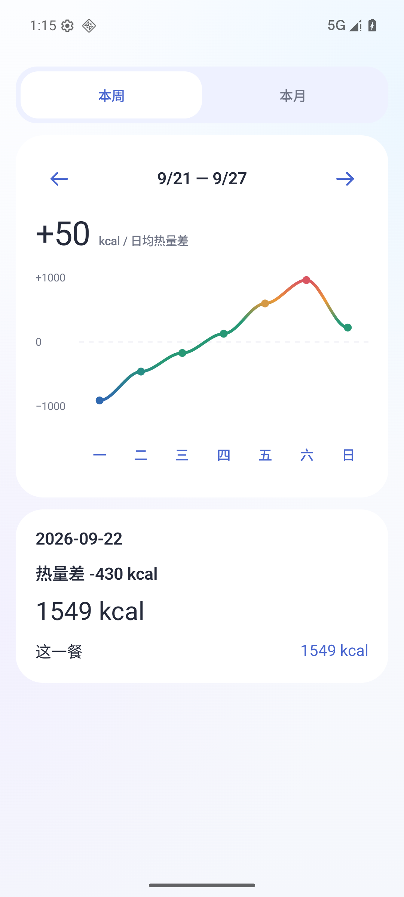
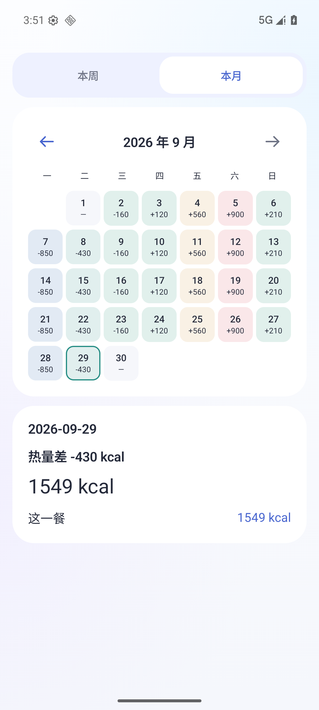

<div align="center">

# ChileMe

用聊天和拍照记录饮食，管理每天的热量摄入。


[](LICENSE)

[English](README.md) · 简体中文

</div>

## 特性

- **AI Native**：拍照或聊天即可记餐、记录运动。饮食卡片可以编辑，确认后入账。
- **本地记录**：无需注册，饮食、身体资料和对话保存在手机上。
- **轻量化**：Release 安装包约 4 MB，聊天与饮食列表按需分批加载。
- **自选模型**：填入自己的 API Key，连接兼容 Chat Completions 的服务，聊天和识图模型可分别设置。

<p align="center">
  
  
  
  
</p>

<p align="center"><sub>截图使用演示数据</sub></p>

## 开始记录

1. [下载 1.0.0 Release APK](https://github.com/Sonder037/ChileMe/releases/download/v1.0.0/chileme-1.0.0-release.apk) 并安装，或按下方步骤自行构建。支持 Android 9 及以上。
2. 首次打开，选择性别，滚动填写年龄、身高和体重，选择默认活动情况，再填入 API Key。
3. 拍一张食物照片，或说一句“午饭吃了这些”。核对卡片里的食物和份量，点确认即可记录。

推荐接入 **DeepSeek Flash**。默认地址为 `https://api.deepseek.com`，预填模型名为 `deepseek-flash`；如服务商使用其他名称，可在设置中修改。识图需要模型支持图片输入。

使用 AI 时，消息、照片及相关记录会发送给所选服务商，调用费用由服务商收取。卸载或清除应用数据会删除本地记录，目前不支持导出恢复。

## 构建与验证

使用 Android Studio 打开项目，准备 JDK 17 或更高版本与 Android SDK 36.1。

```sh
./gradlew :app:testDebugUnitTest :app:lintRelease :app:assembleRelease
```

## 许可证

© 2026 Sonder037 · [AGPL-3.0-only](LICENSE)。允许商用；分发及修改后的网络服务须按协议向相关用户提供对应源码。第三方组件遵循各自许可证。
